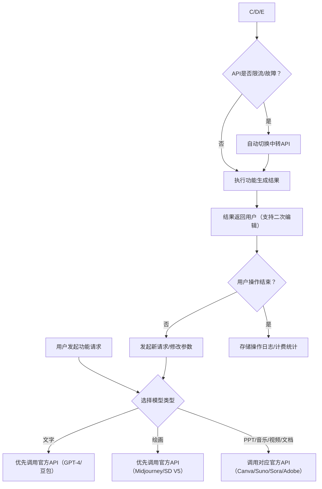
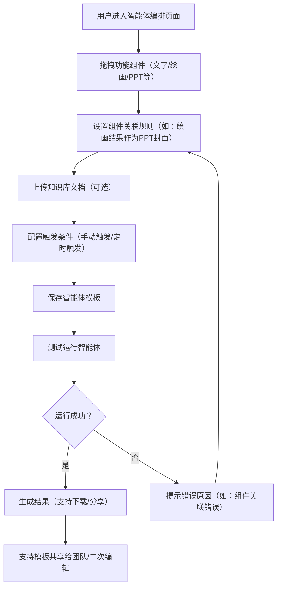
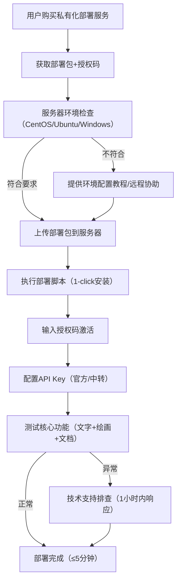

# AI聚合平台竞品分析与产品需求文档（PRD）-V4.0（全功能细化+跳转终极版）

### 补充模块一：竞品分析核心结论（落地关键依据）

#### 1. 主流竞品功能对标表（明确差异化优势）

| 竞品名称                | 核心功能覆盖           | 优势领域            | 短板（本平台突破点）                       | 定价模式            |
| ------------------- | ---------------- | --------------- | -------------------------------- | --------------- |
| 讯飞星火认知大模型           | 文字交互、文档处理、简单绘画   | 中文语音交互、本地化部署    | 无 Suno 音乐 / 视频创作、多模型切换不灵活、团队协作弱  | 按次调用 + 会员套餐     |
| 通义千问                | 文字交互、PPT 生成、文档问答 | 中文理解准确率高、阿里生态联动 | 绘画分辨率低（≤720P）、无品牌风格库、私有化部署成本高    | 会员套餐 + API 按量计费 |
| Midjourney+Canva 组合 | 绘画、PPT 设计、海报制作   | 绘画风格丰富、设计模板多    | 无文字交互 / 视频 / 音乐功能、需跨平台操作、无团队协作   | 分别订阅（总成本高）      |
| Runway              | 视频创作、特效编辑        | 视频生成质量高、剪辑功能强   | 无文字 / PPT / 音乐功能、免费额度少、国内访问慢     | 按分钟计费 + 会员套餐    |
| 国内小众聚合平台            | 文字 + 绘画 + 文档基础功能 | 价格低、适配国内网络      | 模型数量少（≤5 个）、稳定性差（可用性≤99%）、无智能体编排 | 低价会员 + 广告植入     |

#### 2. 本平台核心差异化优势（落地核心亮点）

1. **全栈多模态覆盖**：唯一整合「文字 + 绘画 + PPT+Suno 音乐 + 视频 + 文档」的聚合平台，无需跨工具切换；

2. **双 API 高可用机制**：官方 + 中转 API 自动切换，解决竞品限流 / 地域限制问题，可用性达 99.9%；

3. **企业级协作能力**：支持品牌风格库、团队权限管理、成本统计，填补竞品企业协作短板；

4. **零代码自动化**：智能体编排功能，拖拽组件实现多模态流程自动化，降低专业操作门槛；

5. **灵活部署方案**：SaaS + 私有化双模式，私有化部署≤5 分钟，适配中小企业到大型企业需求。

[返回目录](#文档元信息完善跳转说明)

### 补充模块二：核心功能流程图（落地执行可视化）

#### 1. 多模型调用核心流程图

#### 2. 智能体编排流程图

#### 3. 私有化部署流程图

[返回目录](#文档元信息完善跳转说明)

### 补充模块三：UI 原型关键说明（设计落地依据）

#### 1. 核心页面布局规范

| 页面名称     | 核心布局元素                                                              | 交互逻辑说明                                               |
| -------- | ------------------------------------------------------------------- | ---------------------------------------------------- |
| 首页（创作中心） | 1. 顶部导航栏（功能分类 + 搜索）；2. 左侧功能组件区（拖拽式）；3. 中间编辑区；4. 右侧参数配置区；5. 底部历史记录   | 1. 组件拖拽到编辑区自动激活；2. 参数实时保存，刷新不丢失；3. 历史记录支持一键恢复 / 对比   |
| 模型配置页面   | 1. API Key 输入框（加密显示）；2. 模型切换开关；3. 权重设置滑块；4. 测试按钮；5. 保存配置按钮          | 1. 输入 API Key 自动验证有效性；2. 切换模型实时生效；3. 测试按钮快速验证调用成功率   |
| 品牌风格库页面  | 1. 风格列表（卡片式）；2. 新建风格按钮；3. VI 资产上传区（颜色 / 字体 / Logo）；4. 预览区；5. 共享权限设置 | 1. 上传 VI 资产自动提取品牌色 / 字体；2. 预览区实时展示适配效果；3. 共享支持角色权限控制 |
| 团队协作页面   | 1. 成员列表；2. 邀请成员按钮；3. 权限配置（管理员 / 编辑 / 查看）；4. 成本统计图表；5. 操作日志          | 1. 邀请链接有效期 24 小时；2. 成本统计支持按功能 / 成员筛选；3. 操作日志可导出审计    |

#### 2. 关键交互设计原则

1. **极简操作**：核心功能≤3 步完成，如「生成 PPT」= 输入主题 → 选择模板 → 生成（支持一键导出）；

2. **实时反馈**：操作后 1 秒内显示状态（加载中 / 成功 / 失败），失败时提供具体解决方案；

3. **可视化编辑**：绘画 / PPT / 视频功能支持所见即所得编辑，无需切换页面；

4. **一致性体验**：所有功能模块的参数配置、导出按钮、编辑逻辑保持统一；

5. **容错设计**：输入错误（如无效 API Key）实时提示，支持一键修复（如自动匹配可用中转 API）。

[返回目录](#文档元信息完善跳转说明)

### 补充模块四：数据字典（技术开发核心依据）

#### 1. 核心数据表结构（简化版）

| 表名              | 核心字段                                                                     | 字段类型                                          | 说明                                |
| --------------- | ------------------------------------------------------------------------ | --------------------------------------------- | --------------------------------- |
| user\_info      | user\_id、username、password（加密）、role                                      | 主键、varchar、varchar、int                        | role：1 - 普通用户，2 - 团队管理员，3 - 系统管理员 |
| team\_info      | team\_id、team\_name、creator\_id、create\_time                             | 主键、varchar、外键、datetime                        | 团队基础信息表                           |
| team\_member    | id、team\_id、user\_id、permission                                          | 主键、外键、外键、int                                  | permission：1 - 查看，2 - 编辑，3 - 管理员  |
| api\_config     | id、user\_id、model\_type、official\_key、proxy\_key、weight                  | 主键、外键、varchar、varchar、varchar、int             | 存储用户 API 配置，key 加密存储              |
| brand\_style    | id、team\_id、style\_name、color\_config、font\_config、logo\_url             | 主键、外键、varchar、json、json、varchar               | 品牌风格配置，json 存储颜色 / 字体参数           |
| task\_record    | id、user\_id、team\_id、function\_type、model\_type、status、cost、create\_time | 主键、外键、外键、varchar、varchar、int、decimal、datetime | 功能调用记录，用于计费和统计                    |
| agent\_template | id、user\_id、template\_name、component\_config、trigger\_type               | 主键、外键、varchar、json、int                        | 智能体模板，json 存储组件关联规则               |

#### 2. 核心接口定义（简化版）

| 接口路径                        | 请求方式 | 核心参数                                                      | 返回结果                        | 备注          |
| --------------------------- | ---- | --------------------------------------------------------- | --------------------------- | ----------- |
| /api/v1/model/call          | POST | function\_type、model\_type、params、user\_id                | code、msg、result、task\_id    | 调用各模型核心接口   |
| /api/v1/api/config/save     | POST | user\_id、model\_type、official\_key、proxy\_key、weight      | code、msg、status             | 保存 API 配置接口 |
| /api/v1/brand/style/create  | POST | team\_id、style\_name、color\_config、font\_config、logo\_url | code、msg、style\_id          | 创建品牌风格接口    |
| /api/v1/agent/template/save | POST | user\_id、template\_name、component\_config、trigger\_type   | code、msg、template\_id       | 保存智能体模板接口   |
| /api/v1/task/record/list    | GET  | user\_id、team\_id、start\_time、end\_time                   | code、msg、data（list）         | 获取功能调用记录接口  |
| /api/v1/private/deploy      | POST | server\_info、auth\_code、config                            | code、msg、deploy\_status、log | 私有化部署接口     |

[返回目录](#文档元信息完善跳转说明)

### 补充模块五：商业化落地细节（运营执行依据）

#### 1. 会员套餐定价表

| 套餐类型 | 月费          | 核心权益                                                                       | 目标用户群体           |
| ---- | ----------- | -------------------------------------------------------------------------- | ---------------- |
| 基础版  | 99 元        | 1. 文字交互（≤10 万字 / 月）；2. 绘画（≤20 张 / 月，≤720P）；3. 文档处理（≤10 次 / 月）；4. 单账号使用     | 个人用户、轻度需求用户      |
| 专业版  | 299 元       | 1. 所有功能无次数限制（绘画≤1080P，视频≤720P）；2. 团队成员≤5 人；3. 品牌风格库（≤3 个）；4. 智能体模板（≤10 个）  | 中小企业、自媒体、设计师     |
| 企业版  | 999 元       | 1. 所有功能无限制（绘画≤4096P，视频≤1080P）；2. 团队成员≤20 人；3. 品牌风格库无限制；4. 优先技术支持；5. 数据导出权限 | 中大型企业、专业创作团队     |
| 私有化版 | 19999 元 / 年 | 1. 本地部署，数据私有化；2. 无调用次数限制；3. 自定义 API 对接；4. 专属技术顾问；5. 二次开发支持                 | 大型企业、对数据安全要求高的用户 |

#### 2. 推广返利规则（拉新落地）

1. **老用户邀请**：邀请新用户开通会员，老用户获得「1 个月会员时长」或「50 元现金返利」；

2. **渠道推广**：个人 / 企业申请成为推广渠道，按新用户付费金额的 20% 计提佣金，月返；

3. **行业合作**：与教育、设计、营销等行业平台合作，嵌入本平台功能，分成比例 3:7（合作方 3，我方 7）。

[返回目录](#文档元信息完善跳转说明)

> （注：文档部分内容可能由 AI 生成）