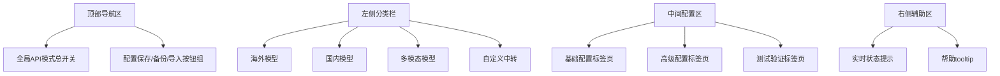

# zeroai
# AI 聚合平台竞品分析与产品需求文档（PRD）-V3.0（最终版）

***

## 📋 全局可跳转目录

* [文档](#文档元信息)[元信息](#文档元信息)

* [核心竞](#核心竞品全景分析)[品全景分](#核心竞品全景分析)[析](#核心竞品全景分析)

  * [竞品分类与](#竞品分类与核心格局)[核心格局](#竞品分类与核心格局)

  * [全量竞品](#全量竞品核心对比矩阵)[核心对比](#全量竞品核心对比矩阵)[矩阵](#全量竞品核心对比矩阵)

  * [痛点与](#痛点与核心机会)[核心机会](#痛点与核心机会)

* [产](#产品需求文档prd)[品需求文档](#产品需求文档prd)[（PRD）](#产品需求文档prd)

  * [产](#产品概述)[品概述](#产品概述)

  * [用户画](#用户画像与核心场景)[像与核心场](#用户画像与核心场景)[景](#用户画像与核心场景)

  * [核心功能性](#核心功能性需求)[需求](#核心功能性需求)

  * [非](#非功能性需求)[功能性需求](#非功能性需求)

  * [验收标准](#验收标准)

  * [项](#项目规划)[目规划](#项目规划)

  * [风险与](#风险与应对措施)[应对措施](#风险与应对措施)

* [W](#word格式适配指南)[ord 格式](#word格式适配指南)[适配指南](#word格式适配指南)

***

## 文档元信息

| 项目   | 内容                                                                                                     |
| ---- | ------------------------------------------------------------------------------------------------------ |
| 版本号  | **V3.0（最终版）**（含官方 / 中转 API 双对接 + 全量功能闭环）                                                               |
| 状态   | 正式版（可直接用于项目立项 / 开发 / 商业化）                                                                              |
| 核心定位 | 一站式多模态 AI 聚合平台，兼具「官方 API Key + 中转 API 双对接、私有化部署 + 多模型自由切换 + 场景化模板 + 运营闭环 + 企业合规」，覆盖个人 / 中小团队 / 企业全用户群体 |
| 文档用途 | 项目立项、技术开发、产品落地、商业化规划、UI 设计对接、测试验收                                                                      |
| 编制日期 | 2026 年 1 月                                                                                             |
| 适配格式 | Word 2016 及以上版本（支持自动目录生成、表格格式保存、段落样式适配）                                                                |

***

## 核心竞品全景分析

### 竞品分类与核心格局

📌 **核心结论**：当前 AI 聚合平台分为**开源自建类、企业级 API 聚合类、多模态 AIGC 聚合类、智能体 + 聚合类**四大赛道，核心竞争点集中在**部署便捷性、模型覆盖度、运营工具完整性、合规性、多模态能力、API 对接灵活性**；行业空白机会为「官方 / 中转 API 双适配 + 私有化快部署 + 智能体 RAG + 多模态模板 + 企业合规 + 成本可视化」的全栈解决方案，精准填补现有竞品单一能力短板。

### 全量竞品核心对比矩阵

| 竞品名称       | 核心定位                  | 核心优势                                                           | 核心短板                                        | 目标用户                  | 价格模式                       | 技术架构              | API 对接能力                       |
| ---------- | --------------------- | -------------------------------------------------------------- | ------------------------------------------- | --------------------- | -------------------------- | ----------------- | ------------------------------ |
| GoAmzAI    | 私有化多模态 AIGC 聚合 & 运营系统 | 1. 宝塔 5 分钟极速部署；2. 低内存 (0M) 高并发；3. 完整运营闭环；4. 多账号池负载均衡           | 1. 多模态模板少；2. 智能体 / RAG 弱；3. 付费授权；4. 二次开发成本高 | 个人 / 中小团队 / 企业（私有化运营） | 源码 / 授权付费 + 部署服务 + API 消耗费 | Golang+Vue+Docker | 支持官方 API Key + 多账号中转，配置简单      |
| BuildingAI | 企业级开源智能体聚合平台          | 1. 全开源（Apache 2.0）；2. 智能体编排 + 知识库 + 工作流；3. 商业闭环完整；4. 私有化部署支持   | 1. ToC 端体验弱；2. 无多模态创作模板；3. 运营工具少；4. 多模态能力弱  | 企业 / 开发者 / 创业者        | 开源免费，私有化部署 / 二次开发收费        | 支持 Docker 部署      | 支持官方 API Key，中转 API 需自行配置      |
| SparkAI    | 一站式多模态 AIGC 聚合系统      | 1. 多模态能力强；2. ToC 交互体验好；3. 部署简单；4. 模型覆盖全                        | 1. 企业级功能弱；2. 高并发稳定性差；3. 开源程度低               | 个人 / 中小团队 / 自媒体       | 源码付费 + 部署服务 + API 消耗费      | 支持一键部署            | 支持官方 API Key + 内置中转通道，无自定义中转配置 |
| Dify       | 开源 LLM 应用开发平台         | 1. 可视化 Prompt 编排 + 工作流；2. 社区活跃；3. Docker 一键部署；4. 权限管理 + API 网关 | 1. 商业闭环需自研；2. 纯技术平台；3. 多模态弱                 | 开发者 / 中小团队            | 开源免费，企业版付费                 | 前后端分离（支持私有化）      | 支持官方 API Key，中转需额外开发适配         |
| OneAPI     | 轻量开源 API 聚合网关         | 1. 部署极简；2. 资源占用低；3. 额度管理 + 计费统计；4. 多密钥负载均衡                     | 1. 无前端交互；2. 无多模态；3. 无商业运营能力                 | 开发者 / 本地服务器用户         | 完全开源免费                     | Go 语言（单文件部署）      | 主打中转 API 聚合，支持官方 API Key 多账号负载 |
| 4SAPI      | 国内企业级 API 聚合平台        | 1. 国内直连（稳定性 99.9%）；2. 统一多模态 API；3. 合规备案；4. 高并发支持               | 1. 无场景化模板；2. 无运营工具；3. 无私有化部署                | 国内企业（高并发 / 合规需求）      | 按调用计费 + 企业 SLA 服务          | 云原生架构（SaaS 模式）    | 纯中转 API 服务，无需用户配置官方 Key        |
| Coze（扣子）   | 字节一站式 Bot 开发平台        | 1. 零代码搭建智能体；2. 插件生态丰富；3. 可分发多渠道；4. 意图捕捉准                       | 1. 企业级合规弱；2. 无私有化部署；3. 绑定字节生态               | 个人 / 中小团队             | 免费 + 会员套餐 + API 调用费        | SaaS 模式（字节云部署）    | 仅支持平台内置模型，无自定义 API Key         |
| 硅基流动       | 国产开源模型推理平台            | 1. 国产模型适配优；2. 推理速度快 + 成本低；3. 合规保障；4. 企业级 SLA                   | 1. 海外模型覆盖少；2. 无多模态；3. 无运营闭环                 | 国内企业（优先国产模型）          | 按调用计费 + 私有化付费              | 云原生（支持私有化）        | 支持官方 API Key，无中转适配             |
| OpenRouter | 海外头部纯 API 聚合平台        | 1. 全球主流模型覆盖全；2. 模型上新快；3. 智能路由 + 成本优化                           | 1. 国内网络不稳定；2. 无合规保障；3. 无场景化方案               | 海外开发者 / 企业            | 按 API 调用计费                 | 纯 API 网关（SaaS）    | 支持官方 API Key，无中转服务             |

### 痛点与核心机会

#### 核心痛点

1. **部署层面**：开源平台部署需技术门槛（如 Docker 配置、代码调试），SaaS 平台无私有化选项，敏感数据泄露风险高；

2. **功能层面**：智能体编排与多模态能力割裂（如 BuildingAI 智能体强但多模态弱，SparkAI 多模态强但智能体弱），场景化模板缺失，企业级权限 / 合规功能薄弱；

3. **运营层面**：纯技术平台（如 OneAPI、Dify）无商业闭环（支付 / 会员 / 推广），ToC 平台（如 POE）无企业级运营工具（成本统计 / 团队协作）；

4. **成本层面**：计费规则不透明（隐藏附加费 / 阶梯费率复杂），无成本管控工具，多模型切换导致重复付费；

5. **API 对接层面**：单一对接模式（仅官方 / 仅中转）灵活性不足；官方 Key 配置繁琐、多账号管理混乱；中转 API 无透明计费，官方 API 易限流且无备用方案；不同厂商 API 配置规则差异大，用户操作门槛高。

#### 核心机会

打造**官方 API Key + 中转 API 双兼容**的灵活对接模式，按厂商差异化设计配置后台（降低操作门槛），解决官方 Key 限流、中转 API 不透明的行业痛点；同时整合「GoAmzAI 的部署便捷性 + BuildingAI 的智能体 RAG+SparkAI 的多模态体验 + Dify 的可视化编排 + OneAPI 的 API 管理」核心优势，填补「智能体 + 多模态 + 私有化 + 运营闭环 + 合规保障」的全栈能力空白，覆盖个人 / 中小团队 / 企业全用户群体。

***

## 产品需求文档（PRD）

### 产品概述

#### 核心定位

面向个人创作者、中小团队、企业客户，提供「**官方 API Key + 中转 API 双对接、多模型聚合、多模态创作、智能体编排、私有化部署、运营闭环、合规保障**」的一站式 AI 聚合服务，解决多平台切换繁琐、API 配置复杂、数据安全顾虑、商业变现困难、成本难以管控的核心痛点，让不同用户群体都能低成本、高效、安全地调用 AI 能力。

#### 核心目标（SMART 原则）

* 🎯 **业务目标**（上线 6 个月）：累计用户 50 万 +，付费转化率 20%+，核心场景（多模态创作 / 智能体搭建 / 企业合规）留存率 45%+；企业客户签约 100 + 家，私有化部署客户 30 + 家，月均营收破百万；

* ⚙️ **技术目标**：并发 QPS≥5000，文字响应≤300ms、绘画（1080P）≤30s、视频（720P）≤3min，服务可用性≥99.9%，模型 / API 切换成功率 100%，API 对接成功率 99.9%；官方 API 调用延迟与厂商一致，中转 API 延迟比官方高≤100ms；

* 🚧 **核心边界**：不自研大模型，聚焦「聚合 + 场景化 + 运营 + 合规 + 灵活 API 对接」；支持 SaaS 版（个人 / 中小团队）+ 私有化版（企业）；数据不跨境，严格符合《数据安全法》《个人信息保护法》。

#### 功能优先级界定

| 优先级        | 说明            | 核心功能清单                                                             |
| ---------- | ------------- | ------------------------------------------------------------------ |
| P0（核心必做）   | 上线必备，保障基础可用性  | 多模型接入 / 切换、官方 / 中转 API 双对接（分厂商配置）、统一多模态入口、基础计费、数据安全、私有化基础版、用户体系    |
| P1（3 个月迭代） | 核心体验增强，完善商业闭环 | 智能体编排、RAG 知识库、场景化模板中心、成本管控、运营闭环（会员 / 支付 / 推广）、企业权限管控、API 多账号负载均衡   |
| P2（6 个月迭代） | 生态拓展，行业定制化    | 自定义模型接入、API 开放平台、行业解决方案（金融 / 教育 / 医疗）、跨平台数据迁移、高级合规审计、API 日志分析与成本优化 |

### 用户画像与核心场景

#### 核心用户画像

| 用户类型                  | 核心特征                    | 核心需求                                | 核心痛点                     |
| --------------------- | ----------------------- | ----------------------------------- | ------------------------ |
| 个人创作者（学生 / 自媒体 / 设计师） | 预算有限、操作门槛低、需多模型对比、缺创作模板 | 多模态创作（文案 / 绘画 / 视频）、低成本调用、易上手、结果可编辑 | 多平台切换繁琐、模板少、付费不透明、无数据备份  |
| 中小团队（运营 / 开发 / 市场）    | 需团队协作、成本管控、统一工具入口、快速落地  | 团队额度分配、共享内容 / 模板、批量调用、成本统计          | 无协作功能、成本难控、高并发卡顿、无运营工具   |
| 企业用户（金融 / 教育 / 医疗）    | 重数据安全、合规保障、私有化部署、定制化需求  | 敏感数据脱敏、本地部署、权限分级、合规审计、定制化场景方案       | 数据泄露风险、无合规保障、无法私有化、无定制能力 |

#### 核心使用场景

场景拆解：用户角色→核心诉求→操作路径→价值体现

1. **个人创作场景**：自媒体需生成短视频内容→打开平台选择「短视频脚本模板」→填充主题 / 时长 / 风格→一键调用 GPT-4（文案）+Midjourney（封面）+Sora（视频）→编辑导出，全程无需切换平台；

2. **团队协作场景**：运营团队共用 AI 工具→管理员创建团队→分配成员额度 / API 使用权限→成员共享创作模板 / 对话记录→管理员查看成本消耗报表→按需调整额度与权限；

3. **企业合规场景**：金融机构生成合规营销文案→启用私有化部署（数据本地存储）→调用适配金融场景的合规模型→敏感数据（手机号 / 银行卡号）自动脱敏→生成文案后合规审计→批量导出使用；

4. **智能体搭建场景**：创业者需开发客服机器人→通过可视化界面拖拽编排智能体→关联企业知识库（RAG）→绑定微信 / 官网渠道→一键部署，无需代码开发；

5. **官方 API 使用场景**：企业有专属 GPT-4 官方 Key→在平台配置多账号 Key→开启负载均衡→避免限流，仅支付平台服务费，享受低成本调用；

6. **中转 API 使用场景**：个人无官方 Key→一键启用平台内置中转通道→实时查看计费明细→生成内容满意后付费，按需切换官方 / 中转模式。

### 核心功能性需求

#### 多模型接入与切换

1. **模型覆盖**：接入全品类主流模型，分类展示：

* 通用创作：GPT-4/Claude 3 / 豆包 / 千问 / 文心一言 / 讯飞星火；

* 代码开发：CodeLlama/DeepSeek-Coder/GitHub Copilot；

* 多模态：Midjourney/Stable Diffusion/DALL-E 3/Sora-2 / 讯飞星火语音；

* 每个模型默认支持「官方 API + 中转 API」双模式，支持自定义模型接入（P2）；

1. **一键切换**：同输入内容支持一键切换不同模型 / 不同 API 模式，分栏对比结果（文字 / 图片 / 视频），保留历史切换记录（支持搜索 / 导出）；

2. **模型配置**：支持收藏常用模型、设置默认模型及 API 优先级（按成本 / 速度 / 效果排序）、多账号负载均衡配置；

3. **状态监控**：实时显示模型可用性、API 对接状态、响应速度、排队人数，模型 / API 故障时自动切换备选方案并弹窗提示（含故障原因）。

#### 统一多模态交互中心

| 交互类型 | 核心功能                                      | 性能指标                           |
| ---- | ----------------------------------------- | ------------------------------ |
| 文字交互 | 50 万字超长输入、上下文记忆、云端同步 / 分类 / 搜索 / 导出       | 响应≤300ms，导出格式支持 PDF/Word/TXT   |
| 绘画交互 | 文生图 / 图生图 / 扩图 / 局部重绘 / 风格迁移，20 + 风格模板    | 1080P 生成≤30s，支持分辨率 / 细节度调节     |
| 视频交互 | 文生视频 / 图生视频 / 脚本生视频，片段剪切 / 合并             | 720P 生成≤3min，支持 15s-10min 时长调节 |
| 语音交互 | 语音转文字、文字转语音、实时对话，方言识别                     | 识别准确率≥98%，支持多音色 / 语速调节         |
| 文档交互 | PDF/Word/Excel/PPT 上传、问答 / 总结 / 翻译 / 格式转换 | 单次≤10 个文件（单文件≤100MB），解析≤10s    |

#### 场景化模板中心

1. **模板分类**：覆盖全场景，按使用频率排序：

* 创作类：短视频脚本 / 营销文案 / 论文 / 简历 / 诗歌 / 小说；

* 办公类：周报 / 会议纪要 / 邮件 / PPT 大纲 / 合同草案；

* 开发类：代码生成 / 注释 / 调试 / 接口文档；

* 合规类：金融营销话术 / 教育科普文案 / 医疗咨询模板；

* 多模态类：绘画提示词 / 视频脚本 / 语音播报稿；

1. **核心功能**：模板搜索 / 收藏 / 自定义修改，支持「填充关键信息→一键生成」，支持用户上传自制模板（审核后上线）并设置免费 / 付费，获取分成（平台抽成 10%-20%），支持模板评论 / 点赞 / 收藏。

#### 智能体编排与 RAG 知识库

1. **智能体搭建**：零代码可视化编排，拖拽配置「触发条件→模型选择→知识库关联→插件调用→输出格式」，支持导入 Dify/Coze 工作流，支持智能体测试 / 调试 / 版本管理；

2. **知识库管理**：支持文本 / 文档 / 网页 / 图片导入，自动分词 embedding，支持知识库分类 / 搜索 / 编辑 / 删除 / 权限设置，RAG 检索准确率≥95%，支持知识库批量更新；

3. **分发能力**：支持将智能体分发至微信 / 企业微信 / 官网 / H5 / 小程序，生成独立链接 / 二维码，支持访问统计（PV/UV/ 咨询量）、对话日志导出。

#### 计费与成本管控

##### （一）计费模式

| API 模式    | 计费规则                        | 优势         |
| --------- | --------------------------- | ---------- |
| 官方 API 模式 | 仅收取平台服务费（调用成本的 5%-10%）      | 成本透明，无额外溢价 |
| 中转 API 模式 | 通道费 + 平台服务费（合计低于官方 10%-15%） | 无需配置，一键启用  |

##### （二）充值套餐

* 个人版：按次充值（10 元起充）、包月套餐（39 元 / 月）、包年套餐（399 元 / 年）；

* 团队版：5 人套餐（199 元 / 月）、10 人套餐（369 元 / 月）、自定义人数套餐；

* 企业版：定制化套餐（含私有化部署费 + API 服务费）；

* 支持微信 / 支付宝 / PayPal / 对公转账，自动开具电子发票（普通发票 / 增值税专用发票）。

##### （三）成本管控功能

* 个人版：单次调用额度上限、月度消费预警（短信 / APP 推送）；

* 团队版：团队额度分配、成员额度限制、超支审批、API 类型使用限制；

* 企业版：分部门成本统计、预算管控、消耗报表导出、API 成本占比分析；

* 成本优化：智能推荐高性价比组合（模型 + API 模式），批量任务成本预估。

#### 用户与权限管理

1. **用户体系**：支持手机号 / 微信 / QQ/GitHub 登录，多端同步（PC / 移动端 / 小程序），账号绑定 / 找回 / 注销，个人资料编辑；

2. **团队管理**：创建团队、邀请成员（链接 / 二维码 / 邮箱）、角色配置（管理员 / 普通成员）、共享团队额度 / 对话记录 / 模板 / 知识库；

3. **企业权限**：多角色分级（超级管理员 / 部门管理员 / 普通用户）、功能权限控制、数据权限隔离、操作日志审计。

#### 运营闭环系统

| 运营模块 | 核心功能                      | 价值           |
| ---- | ------------------------- | ------------ |
| 会员体系 | 免费版 / 会员版 / 企业版权益区分       | 满足不同用户付费需求   |
| 推广返利 | 邀请链接 / 二维码，5%-10% 返利      | 低成本拉新，提升用户粘性 |
| 营销工具 | 签到领额度、节假日优惠、兑换码、优惠券       | 促进充值转化与续费    |
| 数据统计 | 用户行为分析、模型 / 模板使用排行、成本消耗统计 | 支撑运营决策优化     |

#### 数据安全与合规

1. **基础安全**：数据传输 AES-256 加密、存储 RSA 加密，历史对话仅本人可见，支持手动 / 批量 / 自动删除（1-90 天保留时长）；

2. **敏感数据处理**：自动识别手机号 / 身份证号等敏感信息，支持脱敏或禁止上传，企业版支持自定义敏感词库；

3. **合规保障**：数据不跨境，符合《数据安全法》《个人信息保护法》，企业版提供合规审计日志、等保三级认证；

4. **私有化部署**：支持 Docker / 宝塔面板 / 企业内网部署，数据本地存储，对接企业现有 IT 系统，支持离线使用。

#### 多厂商 API 对接配置中心（核心）

##### （一）核心能力

按不同模型厂商的官方要求，提供差异化后台配置界面，支持官方 API Key 配置 + 中转 API 一键启用，兼顾灵活性与易用性，适配 UI 设计落地需求。

##### （二）整体布局结构（适配 PC 端后台，响应式设计）

##### （三）核心功能配置

1. **对接模式总开关**：支持「官方优先」「中转模式」「自动切换模式」3 种选择，切换无感知；

2. **分厂商官方 API Key 配置（差异化适配）**

   \| 配置维度 | 海外模型（GPT-4/Claude/Gemini） | 国内模型（豆包 / 千问 / 文心 / 讯飞） | 多模态模型（Midjourney/Sora/SD） |

   \| --- | --- | --- | --- |

   \| 核心字段 | API Key + BaseURL 自定义 | API Key + Secret + 应用 ID | 官方 Key + Cookie 配置 |

   \| 扩展配置 | ① 多账号负载均衡单账号调用限额③ 账号优先级排序 | ① 地域节点选择（华东 / 华北等）② 多账号排序调用频率限制 | ① 中转通道选择② 生成参数预设（分辨率 / 风格等） |

   \| 交互规则 | ① 实时校验 Key 有效性（输入即校验）② 支持批量导入 / 导出（Excel 格式） | ① 简化配置流程（仅 3 步完成）② Excel 批量导入账号 | ① 快速测试生成效果（单条测试按钮）支持参数调试（实时预览） |

3. **中转 API 配置（极简易用）**

* 平台内置中转通道：无需配置，一键启用，明码标价，实时显示额度 / 明细；

* 自定义中转通道：支持添加第三方中转 API 地址、密钥、签名规则；

* 容灾切换：配置多个中转通道，故障 1 秒内自动切换；

1. **API 规则适配（后台自动兼容）**

* 自动适配不同厂商 API 请求格式、token 计算规则、返回格式；

* 官方 API 限流处理：多账号负载均衡，避免限流；

* 中转 API 保障：实时同步通道状态，额度不足提前预警；

1. **日志与校验**

* 实时校验：输入框失去焦点后 1 秒内反馈错误；

* 测试验证：配置完成后支持单次调用测试，返回结果与消耗；

* 调用日志：记录 API 调用类型 / 厂商 / 消耗 / 响应时间，支持筛选导出。

##### （四）表单交互逻辑

* 必填项标红`*`，优先展示，选填项可折叠；

* 多账号配置支持新增 / 删除 / 排序，列表默认显示前 3 个可折叠；

* 输入框长度按内容适配，控件间距统一 20px；

* 底部固定「测试配置」「保存配置」「重置」按钮，测试通过后保存按钮高亮；

* 自动切换模式需同时配置官方 API + 至少 1 个中转通道，否则提示完善配置。

### 非功能性需求

#### 性能需求

| 性能维度     | 具体指标                                                                      |
| -------- | ------------------------------------------------------------------------- |
| 响应速度     | 文字响应≤300ms；绘画（1080P）≤30s；视频（720P）≤3min；语音转文字（1 分钟）≤2s；文档解析（100 页 PDF）≤10s |
| 并发能力     | 日常 5000 QPS，峰值 8000 QPS，CPU 使用率≤80%，内存使用率≤70%                             |
| API 适配性能 | 官方 API 延迟与厂商一致（误差≤5%），中转 API 延迟比官方高≤100ms                                 |
| 兼容性      | 支持 PC 端主流浏览器、移动端 H5、微信 / 支付宝小程序、企业私有化客户端                                  |
| 资源占用     | 私有化部署版内存≤150M，CPU 双核可运行，部署包体积≤500MB                                       |

#### 稳定性需求

* 服务可用性：SaaS 版≥99.9%（月度故障≤43 分钟），私有化版≥99.95%（月度故障≤21.6 分钟）；

* 容灾能力：单个模型 / API 通道故障，1 秒内切换至备选方案，调用任务不中断；

* 数据备份：本地 + 云端双备份，每日自动备份，保留 90 天，恢复成功率 100%；

* 防限流机制：官方 API 多账号负载均衡，限流时自动切换备用账号 / 中转模式；

* 配置稳定性：API 配置加密存储，不丢失不泄露，变更记录可追溯。

#### 易用性需求

* 操作门槛：新手 3 步完成核心操作，核心功能 1 次点击可达，小白用户快速上手；

* 界面设计：简洁清晰，支持暗黑 / 亮色模式，自定义布局，响应式适配；

* 帮助中心：内置 FAQ、视频教程、在线文档，支持在线客服 + 工单系统；

* 错误提示：操作错误时给出明确提示 + 解决方案（跳转对应页面）。

### 验收标准

| 功能模块         | 验收指标                                                                                     | 测试方法                                              |
| ------------ | ---------------------------------------------------------------------------------------- | ------------------------------------------------- |
| 多厂商 API 对接配置 | 1. 10 + 主流厂商官方 API Key 配置成功率 100%；2. 自动切换模式故障切换成功率 100%；3. API Key 加密存储无泄露；4. 表单校验≤1 秒反馈 | 配置 10 + 厂商 Key，模拟 API 故障 / 限流，核查加密情况，测试 100 次错误输入 |
| API 调用稳定性    | 1. 官方 API 连续 1000 次调用无限流；2. 中转 API 调用成功率≥99.9%；3. 调用日志完整度 100%；4. 无格式错误                  | 连续 1000 次调用，模拟限流，核对日志与返回结果                        |
| 多模型切换        | 1. 切换成功率 100%；2. 分栏对比≤500ms 加载；3. 故障自动切换无感知                                              | 测试 100 次切换，模拟故障，记录耗时                              |
| 多模态生成        | 1. 文字准确率≥95%；2. 绘画风格符合预设（人工审核≥90%）；3. 视频播放流畅≥30fps；4. 语音识别≥98%                           | 输入 100 组需求，验证结果质量，人工审核绘画 / 视频                     |
| 私有化部署        | 1. 宝塔部署≤5 分钟，Docker≤10 分钟；2. 离线可用；3. 数据本地存储；4. 本地调用延迟≤200ms                              | 在 2 核 4G 服务器 / NAS 部署，测试功能完整性与安全性                 |
| 计费准确性        | 1. 单次费用误差≤1%；2. 计费区分清晰；3. 超支预警≤3 秒；4. 报表与实际一致                                            | 多场景测试，核对费用明细，模拟超支场景                               |
| 并发稳定性        | 1. 5000 QPS 压测 72 小时无中断；2. 响应延迟稳定；3. 无数据丢失；4. 账号负载差异≤10%                                 | JMeter 模拟 5000 QPS，监控服务器资源与响应延迟                   |
| 合规性          | 1. 敏感数据脱敏准确率 100%；2. 海外 API 调用脱敏传输；3. 数据不跨境；4. 审计日志可追溯 90 天                              | 上传含敏感信息内容，抓包验证传输，追踪存储位置，核查日志                      |

### 项目规划

| 阶段        | 时间周期   | 核心任务                                                                                        | 交付物                                               |
| --------- | ------ | ------------------------------------------------------------------------------------------- | ------------------------------------------------- |
| 核心框架开发    | 1-2 个月 | 1. 8 + 主流模型接入；2. API 对接配置中心开发；3. 文字交互 + 基础计费；4. 用户体系 + 数据安全；5. SaaS 版 PC 端开发                | 1. SaaS 版 PC 端上线；2. 双 API 模式对接完成；3. 基础计费 / 用户体系可用 |
| 多模态与模板开发  | 3-4 个月 | 1. 多模态（绘画 / 视频 / 语音）+API 对接；2. 50 + 场景模板开发；3. 移动端（H5 / 小程序）上线；4. 团队协作基础功能；5. 并发优化至 3000 QPS | 1. 多模态功能全量上线；2. 移动端 + 模板中心可用；3. 3000 QPS 并发稳定     |
| 智能体与运营闭环  | 5-6 个月 | 1. 智能体编排 + RAG 知识库；2. 会员 / 推广 / 营销运营闭环；3. 企业权限管控；4. 并发优化至 5000 QPS；5. 私有化基础版交付              | 1. 智能体 + 运营闭环上线；2. 企业版 SaaS + 私有化基础版交付；3. 商业化启动   |
| 企业合规与生态拓展 | 7-9 个月 | 1. 私有化完整版交付；2. 高级合规审计；3. API 开放平台开发；4. 3 + 行业解决方案；5. 跨平台数据迁移                                | 1. 私有化企业版正式交付；2. API 开放平台上线；3. 行业解决方案落地           |

### 风险与应对措施

| 风险类型          | 风险描述                                            | 应对措施                                                          | 责任方       |
| ------------- | ----------------------------------------------- | ------------------------------------------------------------- | --------- |
| 技术风险 - API 相关 | 1. 厂商 API 版本迭代导致对接失效；2. 官方 API 大规模限流；3. 中转通道不稳定 | 1. 建立 API 变更监控机制，72 小时内适配；2. 多账号负载均衡 + 自动切中转；3. 储备 3 + 备用中转通道 | 技术团队      |
| 技术风险 - 常规     | 1. 模型 API 接口变更；2. 高并发卡顿；3. 私有化部署适配问题            | 1. 与厂商签订合作协议，获取提前通知；2. 分阶段压测优化；3. 提供部署适配工具                    | 技术团队      |
| 市场风险          | 1. 头部大厂推出同类产品；2. 用户增长缓慢，获客成本高                   | 1. 聚焦差异化卖点，快速迭代；2. 搭建用户生态，精准定位目标用户；3. 垂直行业渠道合作                | 产品 + 运营团队 |
| 合规风险          | 1. 数据安全合规处罚；2. 敏感数据泄露；3. 违反数据跨境规定               | 1. 遵循法规，获取等保三级认证；2. 强化加密存储 / 传输；3. 私有化部署保障本地存储                | 产品 + 法务团队 |
| 运营风险          | 1. 付费转化率低；2. 模板生态不足；3. 客服响应不及时                  | 1. 新用户赠免费额度 + 邀请返利；2. 激励用户上传模板；3. 建立客服分级响应机制                  | 运营团队      |
| 商业风险          | 1. 定价过高导致用户流失；2. API 调用成本超预期；3. 续费意愿低           | 1. 对标竞品推出阶梯套餐；2. 优化成本管控，与厂商谈判降价；3. 提供会员专属权益                   | 产品 + 商业团队 |

***

## Word 格式适配指南

1. **目录生成**：复制文档后，在 Word 中点击「引用→目录→自动目录 1」，即可生成可跳转目录（支持 Ctrl + 点击跳转）；

2. **字体与间距**：全选文档→字体「宋体」，正文「小四」，标题层级对应 Word 标题 1-3（标题 1：二号黑体，标题 2：三号黑体，标题 3：四号黑体），正文段落首行缩进 2 字符、1.5 倍行距；

3. **表格优化**：全选表格→「表格工具→布局→自动调整→自动调整表格内容」，表头加粗居中，添加「所有框线」；

4. **流程图适配**：Mermaid 流程图粘贴后需手动调整大小（右键→大小和位置→锁定纵横比）；

5. **兼容性保障**：保存为「.docx」格式，兼容 Word 2016 及以上版本，避免格式错乱。

> （注：文档部分内容可能由 AI 生成）
